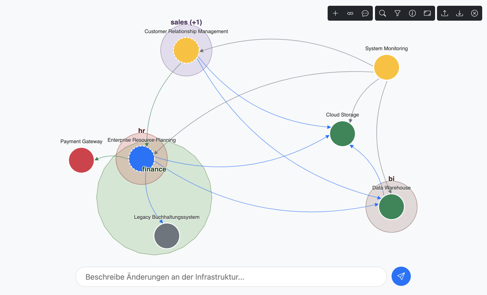

# Webbased IT Infrastructure Visualization


An interactive web application for visualizing and managing IT infrastructures and their dependencies.



Disclaimer: The majority of this web-based tool was generated with Claude and GitHub Copilot. Based on a basic idea, the relevant components were created through several requirement-driven dialogues. Some concepts were manually adjusted, especially to ensure that fundamental coupling and cohesion remained manageable. Nevertheless, the current `index.js` and some other components still contain rather unstructured code for the final integration of UI components, which needs further refactoring.

## Features

- **Interactive Graph**: Visualize IT systems and their dependencies as an interactive graph
- **System Management**: Add, edit, and delete IT systems
- **Connection Management**: Create and manage dependencies between systems
- **Grouping**: Organize systems into groups and visually cluster them
- **Filtering and Search**: Filter systems by category, status, and name
- **Export/Import**: Export and import data in YAML format
- **Position Saving**: Automatically save node positions for consistent layouts
- **LLM Integration**: Chat-based infrastructure management via LLM APIs (Claude or OpenAI)

## Demo

A live demo is available at: [https://marloto.github.io/simple-infrastructure/](https://marloto.github.io/simple-infrastructure/)

## Technologies

- **D3.js**: For interactive visualization and graph layout
- **Bootstrap 5**: For responsive UI/UX design
- **JavaScript (ES6+)**: For business logic
- **Webpack**: For bundling JavaScript modules
- **GitHub Actions**: For CI/CD and automatic deployment
- **LocalStorage**: For client-side data persistence, nothing is stored somewhere else
- **Web Crypto API**: For secure storage of API keys

## Local Development

### Prerequisites

- Node.js (version 14 or higher)
- npm (version 6 or higher)

### Installation

1. Clone the repository:
```bash
git clone https://github.com/marloto/simple-infrastructure.git
cd [repository]
```

2. Install dependencies:
```bash
npm install
```

3. Start the development server:
```bash
npm run dev
```

4. For a production build:
```bash
npm run build
```

## Data Model

The data model is based on YAML format and consists of two main components:

### Systems

Systems represent IT components with the following properties:
- `id`: Unique ID
- `name`: Name of the system
- `description`: Description
- `category`: Category (core, legacy, data, service, external)
- `groups`: Array of group names
- `status`: Status (active, planned, deprecated, retired)
- `knownUsage`: Whether usage is known (true/false)
- `tags`: Array of tags (optional)

### Dependencies

Connections between systems with the following properties:
- `source`: ID of the source system
- `target`: ID of the target system
- `type`: Type of connection (data, integration, authentication, monitoring)
- `description`: Description of the connection
- `protocol`: Protocol used

### Example

```yaml
systems:
  - id: webapp
    name: Web Application Frontend
    description: User interface for end users, runs in the browser
    category: frontend
    groups: 
      - app
    status: active
    knownUsage: true
    tags:
      - web
      - ui

  - id: backend
    name: Application Backend
    description: Server-side logic and API for the web application
    category: core
    status: active
    groups: 
      - app
    knownUsage: true
    tags:
      - api
      - logic
dependencies:
  - source: webapp
    target: backend
    type: api
    description: Communication with the backend via REST API
    protocol: HTTPS
```

## LLM Integration

The application supports integration with LLM services for natural language infrastructure management:

1. Configure your preferred LLM provider (Anthropic Claude or OpenAI)
2. Enter your API key and desired model
3. Describe changes in natural language (e.g., "Add a new system called 'CRM' to the group 'Customer Data'")
4. The LLM generates the corresponding YAML changes and applies them after confirmation

The API key is stored in localStorage so that users do not have to re-enter it on each visit with the same browser. To provide a minimum level of security, the key is not stored in plain text.

## Documentation

The application's architecture is based on the following main components:

- `DataManager`: Central data source for all other components
- `SystemVisualizer`: Manages the D3.js visualization
- `SimulationManager`: Controls the D3 force simulation
- `SystemManager`: Manages adding/editing/deleting systems
- `DependencyManager`: Manages connections between systems
- `LlmIntegrationManager`: Manages LLM integration
- `NodeCache`: Stores node positions between sessions

## Contributing

Contributions are welcome! Please follow these steps:

1. Fork the repository
2. Create a feature branch (`git checkout -b feature/amazing-feature`)
3. Commit your changes (`git commit -m 'Add some amazing feature'`)
4. Push to the branch (`git push origin feature/amazing-feature`)
5. Open a pull request

## License

This project is licensed under the MIT License - see the [LICENSE](LICENSE) file for details.

## Acknowledgements

- [D3.js](https://d3js.org/) for the powerful visualization library
- [Bootstrap](https://getbootstrap.com/) for the UI framework
- [js-yaml](https://github.com/nodeca/js-yaml) for YAML parsing and serialization
- Claude, who has created the most parts of this tool

